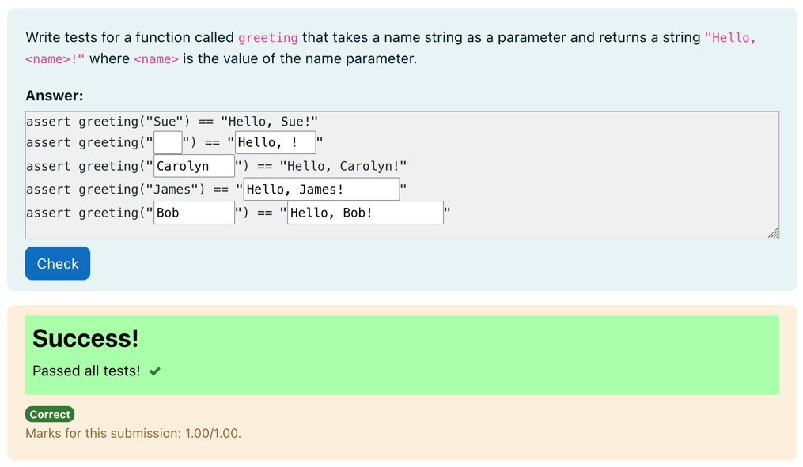
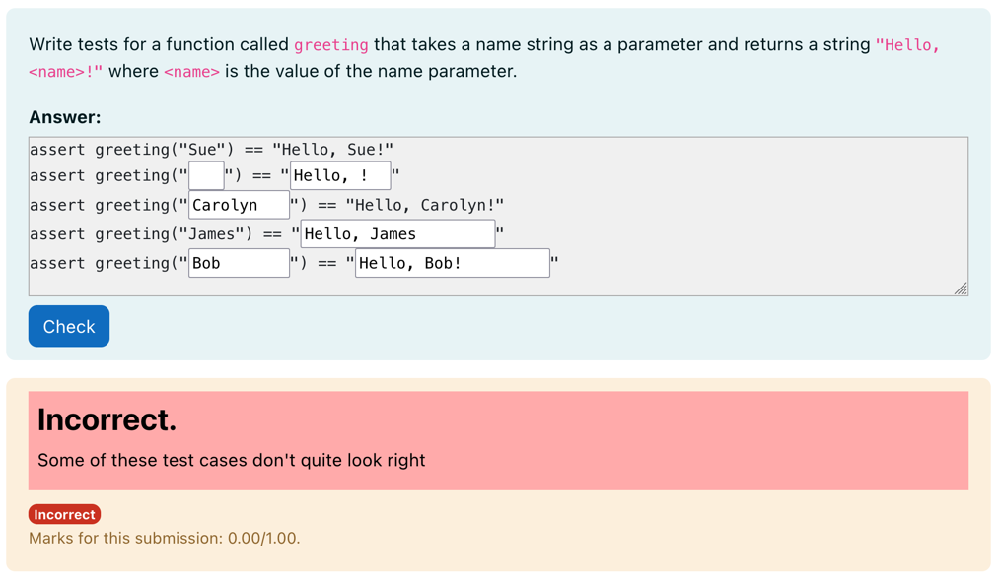
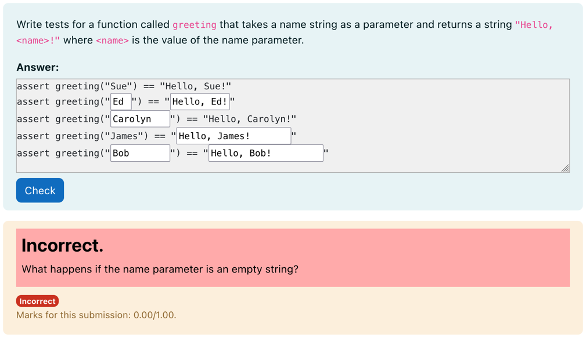

# Python3 Adversarial Test Case Filler

A question type where students must fill in the gaps on informal test cases.
This question type is a subtype of the gapfiller question type.



Several correct and incorrect implementations of a function/code block can be
provided in the question testcases. Test cases marked as correct implementations
must pass the student provided testcases and test cases marked as incorrect must
produce some kind of unexpected output. This is quite easy to do with assert
statements as above.

Loosely, for each test case, the code is constructed and run as:

```
{{ TEST.testcode }}

{{ filled_in_answer }}
```

To mark each test case as correct or incorrect, a `"correct"` flag must be
provided in the testcase extra field. e.g. `{"correct": true}`.

An optional message can be provided in the testcase extra json that will be
displayed if any of the test cases fail (i.e. a correct test case provides
unexpected output or an incorrect testcase provides no unexpected output).

For example:



Here a correct test case is provided with the following code:

```python
def greeting(name):
    return f"Hello, {name}!"
```

The test extra can be set as:

```json
{
  "correct": true,
  "message": "Some of these test cases don't quite look right"
}
```

Messages can also be useful in flagging missed special test cases.
For example (this is not an earth-shatteringly robust example):



Here, an incorrect test case was provided with the following code that only
fails when the input string is empty:

```python
def greeting(name):
    if not name:
        return "Nellow!!"
    return f"Hello, {name}!"
```

The test case is marked as incorrect and given a message that hints at the
missed special case:

```json
{
  "correct": false,
  "message": "What happens if the name parameter is an empty string?"
}
```

In this case, if the student provides correct test cases in the answer box, but
misses this special case, the code will not produce any unexpected output. As
the test case has been flagged as incorrect, this will cause the test to fail
and display the hint message as in the image above.
