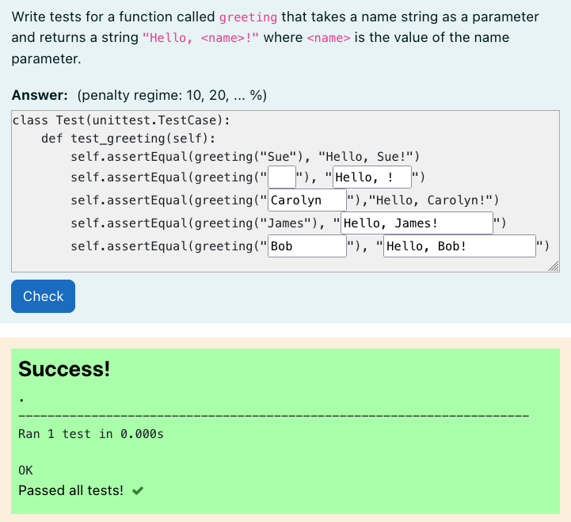
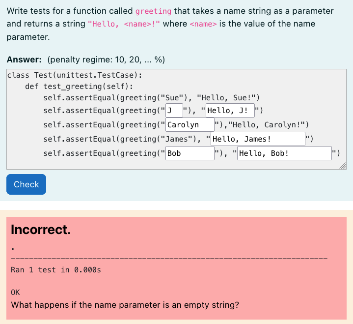

# Python3 Adversarial Unit Test Filler

A question type that requires students to fill in partially complete unit tests
and considered edge cases. This is a subtype of the HTML gapfiller question
type.

Students must correctly enter test cases while considering edge cases:





This question can take several coderunner test cases that provide correct or
incorrect implementations of the class/function that is being tested. Coderunner
test cases are marked as correct by passing a "correct" boolean as json in the
test case extra field: `{"correct": true}`. An optional message can be provided
along with this json that will display iff that coderunner test case fails. For
example, for the second example photo above, the test case extra would be:

```json
{
  "correct": false,
  "message": "What happens if the name parameter is an empty string?"
}
```

Each coderunner test case is constructed as:

```python
import unittest

{{coderunner_testcase}}

{{student_answer}}

...  # Code to discover and run all unit tests
```

Where the student_answer is the filled in global extra gap filler data.

Only the unit test output of test cases marked as correct are displayed to the
student (it would be confusing otherwise).

**Note:** Only the test code and test extra fields are used for the coderunner
test case all other coderunner test case fields are ignored.
