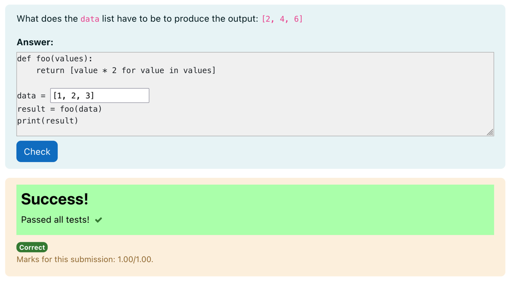
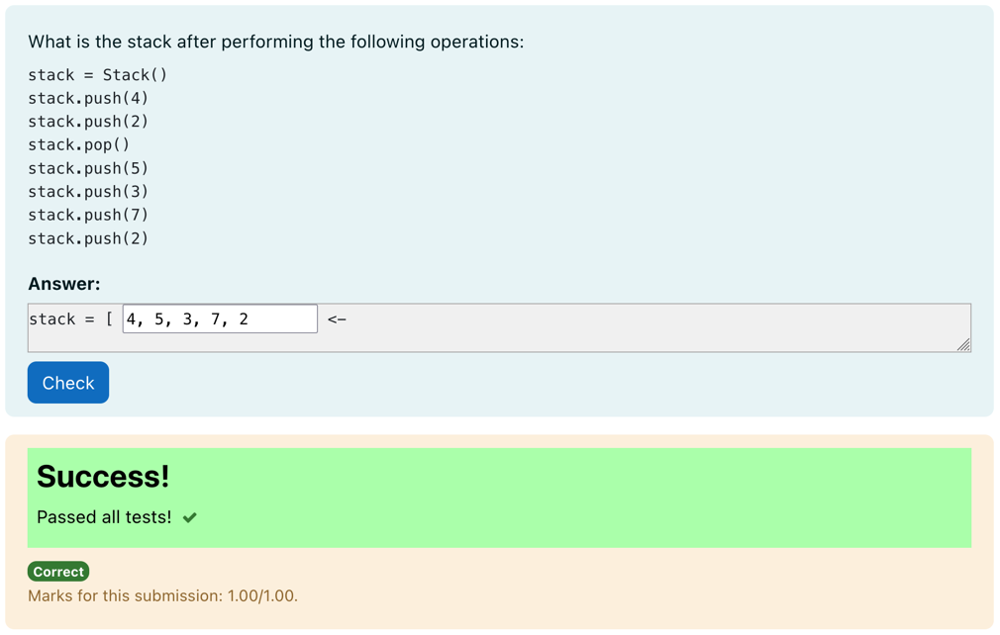

# Python3 Literal Value Gap Filler

A question type for filling in literal Python values.
This question type is a subtype of the gapfiller question type that parses each
gap filler field as a literal Python value.

Useful for checking simple values in a way that ignores spacing etc.

The question type requires only one test case whose test case code is a literal
list of the expected literal values in order. Each answer field is parsed as a
literal python value and is then compared with its corresponding value in the
test case.

While the usual gap filler question type can easily be used to author questions
such as those displayed above, sometimes it is useful to quickly check a literal
value. For example, this question that takes a tuple representing a randomly
constructed stack with special notation:

