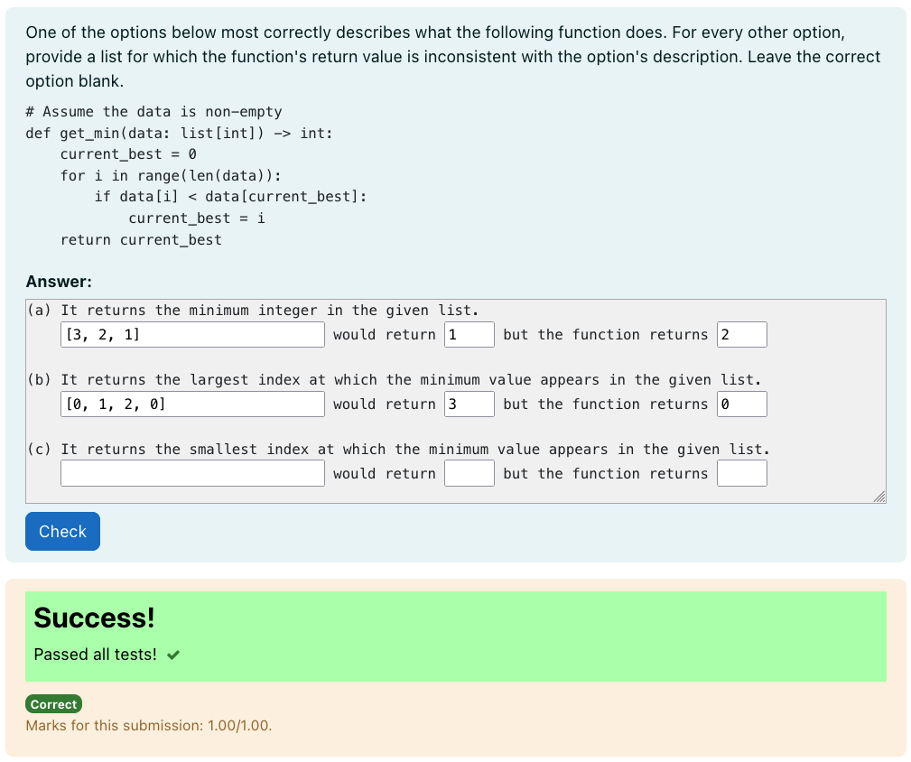

# Python3 Refute

This question type is a subtype of the gapfiller question type and is based on
on Viraj Kumar's refute question type[^1].



Refute questions present students with code and candidate descriptions for what
the code does. Students must then select the correct description, but for every
other incorrect option, they must provide a case where the description produces
different output to the given code.

## Answer Box

The refute question type expects answer fields in groups of three of the form
_given_, _then_, _but_. With each three group corresponding to one of the refute
options. Colloquially, these terms fit this desciption: "_given_ this value,
_then_ the option description suggests this, _but_ the given function would
return this"

A default `refute_options` template parameter is available to consistently
insert the field
block `{[30]} would return {[5]} but the function returns {[5]}`.

For example, for the above refute problem the global extras box would be:

```
(a) It returns the minimum integer in the given list.
    {{refute_options}}

(b) It returns the largest index at which the minimum value appears in the given list.
    {{refute_options}}

(c) It returns the smallest index at which the minimum value appears in the given list.
    {{refute_options}}
```

The `refute_options` template parameter can be modified in the question or
fields can be added manually.

**Note:** Using template parameters in th global extras box causes the answer
box to display incorrectly _in the question authoring form_. However, when
previewing the question or viewing it in a quiz, it displays correctly.

## Testcases

Testcases must be provided that in some way _assert_ that the `given`, `then`,
and `but` values are correct for each option in order. The testcases shouldn't
produce any output if the fields are correct. The `given`, `then`, and `but`
values can be accessed in the test cases with similar syntax to the gap filler
replacement fields: `{[given]}`, `{[then]}`, `{[but]}`. These will be replaced
with each of the answer fields for each test case

For example, for the above refute problem, the first testcase would be:

```python
given, then, but = {[given]}, {[then]}, {[but]},;


def get_min(data: list[int]) -> int:
    current_best = 0
    for i in range(len(data)):
        if data[i] < data[current_best]:
            current_best = i
    return current_best


assert min(given) == then
assert get_min(given) == but
```

It is important that the code does not produce any output for _correct_ answers.
But should either fail or produce some output for incorrect answers. A test case
is considered to have passed if there is no output. The expected output field is
ignored.

For refute questions (as shown above), one test case must accept blank fields.
This could just be the following:

```python
given, then, but = r"""{[given]}""", r"""{[then]}""", r"""{[but]}""",;
assert given == then == but == ""
```

## Parameters

Other than the `refute_options` parameter, an optional
boolean `cases_must_be_different` parameter can be specified. This parameter
is `True` by default and ensures the `then` and `but` fields for each test case
must either be both empty or contain different values.

[^1]: https://dl.acm.org/doi/abs/10.1145/3446871.3469791
