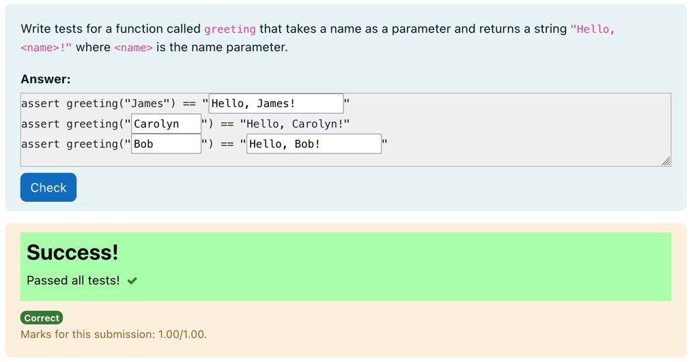

# Python3 Test Case Filler

This is a simpler form of the adversarial test case filler question type.
This question type is a subtype of the gapfiller question type.

It takes one coderunner test case that contains code that is assumed to be
correct. The single coderunner test case takes no testcase extra data and either
displays "Success!" or "Incorrect." with no additional messages.

Can be useful for getting students to write simple test cases where they don't
need to do boundary case testing.

