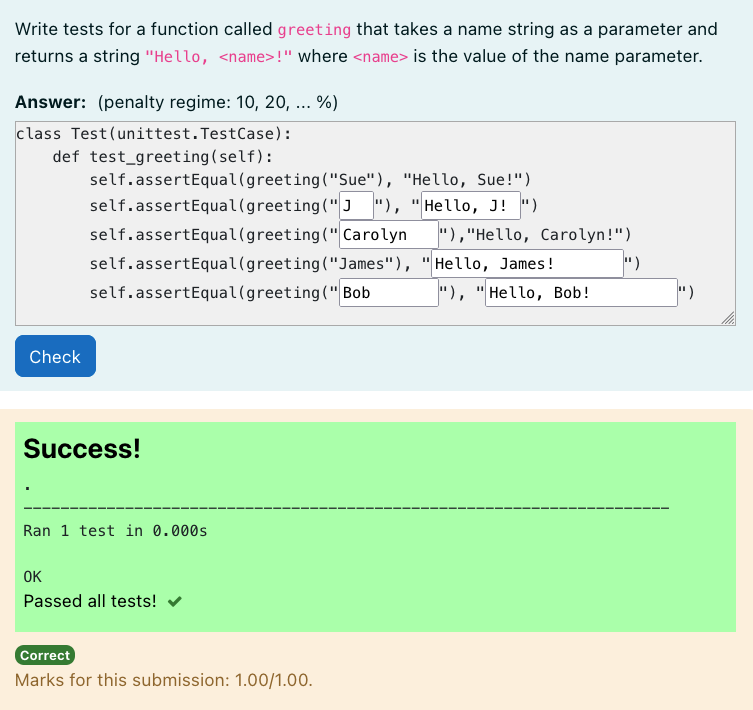
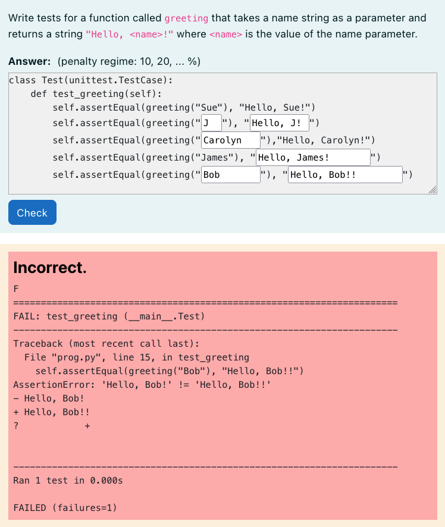

# Python3 Unit Test Filler

A question type that requires students to fill in partially complete unit tests.
This is a subtype of the HTML gapfiller question type.

Will display a report of the test cases as shown below:





This question takes, as a coderunner test case, a correct implementation of
the function/class being tested. The global extra must be filed with gapfiller
code will one or more `unittest.TestCase` classes (or anything else discoverable
by Python's unittest module).

When the code is run, is it loosely constructed as:

```python
import unittest

{{coderunner_testcase_0}}

{{student_answer}}

...  # Code to discover and run all unit tests
```

**Note:** Only the test code field is used for the coderunner test case all
other coderunner test case fields are ignored.
